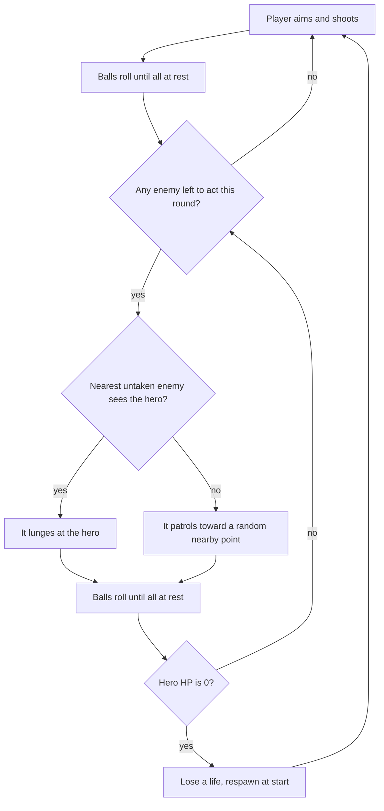

# Dungeonball — MVP Design Doc

Sep 18, 2026 · @Kirk

## Overview

Dungeonball is a portrait phone game where you are a pool ball fighting through dungeon rooms to the exit. It's a roguelike with a light deck-building layer: at the end of each level you pick a trait card, and the cards you hold change how the whole run plays.

You pull back, release, and the ball ricochets off walls, barrels and enemies. Enemies that can see you lunge back, so where you stop matters as much as what you hit.

Design pillars:

- **Billiards feel first.** High-bounce ricochets, knockbacks and combos carry the fun, and stats stay simple.
- **Every stop is a decision.** Ending a shot in an enemy's sightline costs HP.
- **Risk against greed.** Gold is the score. Barrels and chests pay, but lingering near enemies is dangerous.
- **No surprises.** Aim preview, "!" alerts and visible HP bars make every loss legible.
- **Every run is a build.** The trait cards you choose between levels bend the rules in your favour, so two runs play differently.

Target: a true orthographic 3D view at a fixed isometric angle, rendered with Three.js and tested in a desktop browser first. The simulation underneath stays a 2D grid; only the rendering is 3D.

## Core loop and turn structure

A round is one shot by you, then a lunge from each enemy that can see you, one at a time, with everything settling between moves.



The loop repeats until the hero touches the exit, which ends the level at once, even mid-roll.

- **Order:** enemies act nearest-to-hero first, whether they end up attacking or patrolling. Sight is rechecked before each enemy's turn, since earlier moves this round can create or break sightlines.
- **Once per round:** each enemy acts exactly once per round, either lunging at the hero or patrolling, then the turn passes to the next enemy.
- **At rest:** the next launch, lunge or patrol move waits until every ball is below the stop threshold, so positions are always stable before the next move. Nothing moves outside a shot or a turn.
- **Patrol:** each round, a random half of the enemies (rounded up) are picked to patrol; the rest sit the round out unless they can see the hero, in which case they still lunge. A picked enemy that does not currently see the hero picks a random open floor tile within about 3 tiles (one it can roll to in a straight line, with no ball on it) and rolls toward it at the modest speed (1 to 3 tiles/s) that friction brings to rest there. It behaves like any pool ball on the way, so it can still bounce off walls, barrels and other enemies. If no open tile is available, it stays put for that turn. Every move is shown: the camera visits each enemy on its turn (see the camera section).
- **Exit:** enemies never follow you out. Killing everything is not required.
- **Enemy lunge:** an enemy that currently sees the hero launches in a straight line at it at a fixed speed instead of patrolling. Its "!" pulses for about half a second first, with a growl, so the attack never comes out of nowhere. Like any pool ball, it stays wherever it stops, which becomes its new position. Its hit only counts at an impact of at least 0.4 tiles/s, and it can hurt the hero at most once per turn.

## Ball physics and input

Physics is a small custom circle solver on a fixed timestep, because the pool feel is the whole game. Matter.js is the fallback if the solver proves too much work.

Every value below is a starting point to tune by feel. Distances are in tiles.

| Parameter | Start value | Why |
| --- | --- | --- |
| Ball diameter | 0.65 tile | Leaves room to thread one-tile gaps |
| Cancel radius | 0.6 tile | Releasing closer than this cancels; wide enough to read as its own space |
| Full-power drag | 1.6 tiles | Drag distance that reaches max launch speed |
| Max launch speed | 9 tiles/s | Reached at full drag |
| Friction | 1.75 tiles/s² constant | About 5 s and 23 tiles to stop from full power (halved from 3.5 after playtesting) |
| Stop threshold | 0.25 tiles/s | Below this a ball counts as at rest |
| Wall bounce | keeps 90% of speed | High bounce, as requested |
| Barrel and chest bounce | keeps 70% of speed | Loses some speed on impact |
| Ball-to-ball collision | equal mass, keeps 90% | Pool-style momentum transfer |
| Enemy lunge speed | 6 tiles/s | Fixed for every enemy in the MVP |
| Physics step | 1/120 s, fixed | Fastest ball moves 0.075 tile per step, so nothing tunnels |

Aim is a slingshot pull-back: press on the hero, drag away from the target, release to launch the opposite way. Mouse and touch share one pointer path, raycast onto the ground plane so a drag means the same thing from any camera angle, and the pull-back keeps the finger off the line of fire. There's no cue stick sprite and no filling power ring; the dashed path preview below carries the aiming information, with a faint cancel marker around the hero.

- **Power:** drag distance past the cancel radius sets launch speed, reaching full power at about 1.6 tiles; it doesn't depend on the drag's angle.
- **Your turn:** whenever you can shoot, a dashed green ring (as in your mockup) turns slowly around the hero at the cancel radius. It gives way to the cancel marker as soon as you start dragging, and is hidden while anything is moving or the enemies are acting.
- **Cancel marker:** while you drag, a thin, low-opacity circle at the cancel radius and a small "x" just below the hero on screen (inside the circle) mark the cancel zone. Both brighten while your finger is inside it, and disappear when you release.
- **Cancel zone:** within about 0.6 tile of the hero the preview disappears, which reads as "release here to cancel." Releasing inside it cancels the shot; releasing past it fires.
- **Preview:** a dashed line on the ground that runs the shot through the real physics ahead of time, so its length is exactly how far the ball will travel at the current power, including friction and bounce losses. It shows the first bounce, then ends where the ball stops or at its next contact. A small hoop marks each bounce and the end of the path, so the ball's next position is always marked, whether it comes to rest in the open or against something. The dash pattern also encodes power: a soft shot draws short, sparse dots, and a hard one draws long dashes packed close together.
- **Locked:** while any ball is moving or during the enemy phase.

## Combat rules and formulas

Who takes damage depends on whose phase it is, never on ball speed. Speed only decides how far things travel.

| Contact | Your shot | Enemy phase |
| --- | --- | --- |
| Hero hits enemy | Enemy loses ATK HP on each fresh contact | No damage |
| Knocked enemy hits enemy | Both lose 1 HP, once per pair per shot | No damage |
| Enemy hits hero | No damage to hero | Hero loses HP, only from the enemy whose turn it is (lunging or patrolling) |
| Anything hits a wall | No damage | No damage |
| Hero hits barrel or chest | Counts | Counts (recoil hits too) |
| Enemy hits barrel (e.g. one you knocked into it) | Cracks it | Cracks it |
| Hero or enemy hits red barrel | That ball takes 1 flat damage | That ball takes 1 flat damage |

Damage and health formulas, with L as the enemy's level:

```latex
D_{\text{enemy}} = \text{ATK} \qquad D_{\text{hero}} = 1 \qquad \text{HP}_{\text{enemy}} = 2L
```

| Stat | Start value | Notes |
| --- | --- | --- |
| Hero max HP | 10 | A health potion heals 1 and a super health potion 5, capped at max |
| Hero ATK | 1 | A sword adds 3 (ATK 4) for your next two hits on enemies |
| Shield | None held | A held shield cancels the next enemy hit or red-barrel blast on you and is used up by it (replaces DEF, now that every hit costs 1 HP) |
| Enemy level L | 1 to 3 in the MVP | Read from the enemy's HP bar: one notch per HP, and the bar grows longer for tougher enemies |
| Kill reward | L gold | Drops as coins where it died |

Combo example: with ATK 1, you hit enemy A and it slides into enemy B. A takes 2 damage in total and B takes 1. A level-1 enemy has 2 HP, so A dies and B is left at 1 HP if it is also level 1.

Combos are called out so you can see them land. Within a single shot, the first enemy you damage shows the usual "-1"; every further enemy damaged in that shot (the second, third and so on) also shows "Combo!" above it. If two or more enemies die in one shot, "Combo Kill!" appears in the centre of the screen, and it earns a **bonus turn**: the enemy phase is skipped and you shoot again straight away. When an enemy hits you, your ball flashes red for about a quarter of a second.

Pinning works too. Trap an enemy between you and a wall and your rebound can hit it again within the same shot. A hit counts only at an impact speed of at least 0.4 tiles/s (just above the stop threshold, so any visible contact lands; it was 1.5 until halving friction made slow roll-ins common), with a 0.15 s cooldown per enemy, so a ball resting against another cannot grind it down.

Every enemy that currently sees the hero shows a "!" above it, updated live even mid-shot, so you can steer toward a safe stopping spot. Sight range is 6 tiles. Walls, barrels, closed doors and other enemies block sight, and sight is a hero-width sweep so a lunge can really reach you. Watchers off screen get an edge marker. An enemy's face shows its awareness too: while it can't see you it wears a calm, slightly dumb face; the moment it can, its face turns angry (slanted eyes, hard brows, a snarl) alongside the "!", and it calms down again when it loses sight of you.

## Lives, death and progression

You have 3 lives. Reaching 0 HP costs one life and puts you back at the level start with full HP, while the board stays exactly as you left it.

- **Death screen:** at 0 HP, input is blocked and the screen darkens for 3 seconds with "You Died!" and, on a second line, the lives left ("2 lives remain", "1 life remains") or "Game Over". Anything still rolling stops under it, you're put back at the start (or the level restarts on a game over), and the screen lightens again with your move. Lives aren't shown in the HUD otherwise.

- **Board state persists:** dead enemies stay dead, damaged enemies stay damaged, broken barrels stay broken, opened chests and doors stay open, and keys you hold stay with you.
- **Respawn is safe:** enemies only act after your shot, so you always get the first move after respawning.
- **Extra lives** come only from a rare barrel drop (a 1-up).
- **Game over** at 0 lives restarts the current level from scratch with 3 lives, and the HP and gear you entered it with.
- **Between levels:** HP, gear bonuses, lives and score carry over. Unused keys do not.

Gold is the score, and it is where the risk against greed tension lives. Kills score and reduce future danger. Barrels and chests score too, but they keep you out in the open among enemies that are still alive.

Shots taken are tracked and shown on the level-complete screen but do not affect the score in the MVP.

## Trait cards

Trait cards are the roguelike layer. Each is an always-on ability that lasts for the rest of the run.

- **Slots:** you hold up to 3 cards.
- **The pick:** at the end of each level you're offered 3 cards and choose 1. If your 3 slots are full, you then pick one of your cards to replace. You can skip at any point, from the offer or the replace step, and keep what you have.
- **Always on:** cards have no activation and no cooldown; their effect simply applies while you hold them. A small row of held cards sits in the HUD.

Starting cards (numbers are defaults to tune):

| Card | Effect |
| --- | --- |
| Vampirism | Each kill heals you 1 HP, capped at max |
| Doppleganger | +1 life, and +1 to the lives you're restored to on a game over |
| Junk Hunter | Swords and shields turn up twice as often in barrels |
| Bullionaire | All gold you collect is worth 1.5× (rounded up) |
| Scavenger | Barrels break in one hit |
| Locksmith | Doors open without keys |
| Athletic | Your ball rolls faster and farther: 25% less friction on it (enemies unaffected; the aim preview includes it) |

Defaults assumed until you say otherwise: an offer never includes a card you already hold, and a card you replace goes back into the pool. Cards carry over between levels like HP and gold, and a game over restores the cards you entered the level with.

## Objects

Barrels, chests, keys and doors are the level's furniture. Chest gold is granted immediately with a short floating label above the hero; barrel loot lands on the floor for you to roll over.

| Object | Behavior |
| --- | --- |
| Barrel | Solid bumper. Each contact above 0.4 tiles/s, from the hero or an enemy (say one you knocked into it), cracks it one stage, with a 0.15 s cooldown per barrel. The second hit breaks it and leaves random loot on the floor where it stood, collected like enemy coins by rolling over it (so taking the loot is the "third hit"). The crack is obvious at a glance: the barrel gets darker, shorter and more faceted, and leans. |
| Chest | Solid bumper. The first contact opens it and grants a random 8 to 24 gold. |
| Key | Floor pickup, collected by rolling over it. Color-matched to one door and shown in a HUD slot. |
| Door | Solid and opaque until the hero is within half a tile while holding the matching key. Then it opens for good and the key is consumed. Enemies can pass through an open door. |
| Exit | Ends the level when the hero's center enters its tile. |
| Coins | Dropped where an enemy dies, worth its level in gold. Collected by rolling over them, so grabbing them can pull you back into an enemy's sight. |
| Explosive barrel (red) | Solid bumper with the same physics as a barrel. Any contact from the hero or an enemy, at any speed, detonates it: the ball that touched it takes 1 flat damage, ignoring ATK, and the barrel is destroyed with no loot. If it's you and you hold a shield, the shield takes the blast instead ("Blocked!") and is used up. |

Every barrel drops something, left on the floor where the barrel was. You collect it by rolling over it, unless you can't use it right now: a shield while you already hold one, or a potion (or super potion) while your HP is full. Then it stays there, visible, until you roll over it once you can use it. Starting weights, to tune by feel:

| Result | Chance | Effect |
| --- | --- | --- |
| Gold | 45% | +1 to +5 gold, added to your score |
| Health potion | 25% | +1 HP, capped at max |
| Super health potion | 8% | +5 HP, capped at max |
| Shield | 12% | You now hold a shield: it cancels the next enemy hit or red-barrel blast on you, then is used up. Shields don't stack |
| Sword | 5% | +3 ATK (ATK 4) for two hits on enemies: after the first it shows as a broken half-blade, after the second it's gone |
| 1-up | 5% | +1 life |

There is no inventory. Each pickup floats above the hero, for example "+1 HP", "+5 HP", "+3", "Shield", "Sword" or "1-up". Like every floating value (damage numbers, "Combo!", labels), it's set large (about twice the HUD text size), rises for about half a second and then holds still for another half second before fading, so it can be read. Anything about you (gold, including a chest's, health, gear, "Blocked!", damage you take) floats above your ball and rides along with it; labels about an enemy stay where they were earned. (A config switch, `render.heroLabelsFollowBall`, leaves your labels in place instead, if that reads better.) Floating values are always kept inside the visible screen. While you hold gear, its icon sits beside your ball: the sword (whole or broken) to the right, the shield to the left. Barrels crack from any ball, so knocking an enemy into one breaks it too; only the hero opens chests.

A red barrel is a hazard, not a reward: it can hurt an enemy that bumps it as easily as it can hurt you, so it's worth luring enemies into one.

You hold at most one shield; while you hold one, another shield stays on the floor until yours is used up. Likewise, a sword stays on the floor while you hold an unbroken one; picking one up over a broken sword restores it to two hits.

## Levels

Each level is a plain text file with one character per tile. The screen shows about 9 tiles across, and levels can be any size; the camera follows the hero, so larger ones scroll.

| Character | Meaning |
| --- | --- |
| `#` | Wall |
| `.` | Floor |
| `S` | Hero start |
| `X` | Exit |
| `O` | Barrel |
| `C` | Chest |
| `1` to `5` | Enemy of that level |
| `r` `b` `y` | Key: red, blue, yellow |
| `R` `B` `Y` | Door matching that key |
| `E` | Explosive barrel (red) |

An illustrative level in this format, with one enemy, two barrels, a chest, a red key and a red door in front of the exit:

```text
#########
#...X...#
#.......#
###R#####
#.......#
#.O.1.O.#
#.......#
#.C.r...#
#.......#
#...S...#
#########
```

Barrel loot is random by default. Per-barrel overrides can be added later without changing the format.

The five MVP levels ramp one idea at a time. Sizes are suggestions in tiles.

Until the other levels exist (M6–M7), Long Hall is the only level and reaching its exit starts it over: the hero goes back to its start and the enemies reset.

| # | Name | Size | Enemies | Keys and doors | Teaches |
| --- | --- | --- | --- | --- | --- |
| 1 | Long Hall | 12×32 | Eight, levels 1 to 3 (a touching pair blocks the first doorway), plus six barrels, three chests and two red barrels | None | Aiming, bouncing, hitting enemies, combos, the exit |
| 2 | Breakables | 9×20 | Two level-1 | None | Barrels, chest, potions, sightlines |
| 3 | One Key | 12×20 | Level 1 and level 2 | Red | Keys, doors, hiding from sight |
| 4 | Two Keys | 14×24 | Four, levels 1 to 3 | Red, blue | Routing, combos, using enemies as blockers |
| 5 | Gauntlet | 16×32 | Seven, levels 1 to 3 | Red, blue, yellow | Scrolling, risk against greed, everything together |

## Camera, HUD and presentation

The camera is a true orthographic projection at a fixed isometric angle matched to your mockup: the grid is turned about 30° on screen (columns run gently down-right, rows run steeply down-left) and seen from about 37° above the ground, so parallel lines never converge and scale stays constant with distance. It never rotates and has no manual zoom; it pans and zooms automatically to frame the action, as below.

- **Camera type:** `THREE.OrthographicCamera`, fixed isometric angle, no rotation or manual zoom in the MVP. Angles live in the config as `camera.yawDeg` (30) and `camera.elevationDeg` (37).
- **Frame the action:** the camera eases its centre and zoom to fit whatever matters right now, with about 2 tiles of padding, so no collision or combo happens out of view. While balls are moving, that's every moving ball (not every enemy, only the ones in motion); at rest on your turn, it's the hero, centred. It zooms out at most to 22 tiles across, and it keeps its view inside the level's on-screen outline wherever the level is big enough to fill the screen, so it doesn't show empty space past the level's edge (near an edge, the hero sits off-centre as a result).
- **Aiming:** while you drag, the zoom follows shot power: from the resting width at no power out to 13 tiles across at full power, easing smoothly and anchored on the ball (no panning), so pulling harder shows more of where the shot will go. The drag is measured in screen terms from the moment you pressed, so the zoom never feeds back into the shot's power, and the cancel marker keeps its size on screen so it always matches where releasing cancels.
- **Enemy phase:** the camera visits each enemy on its turn, patrols included. Before a lunge it frames the attacker and the hero; before a patrol, the enemy and the tile it's heading for; while it moves, the enemy and every ball in motion. An enemy waits for the camera to arrive (up to 1.5 s) before it moves.
- **View size:** the orthographic frustum has a base width of 9 tiles measured across the screen (with the grid turned, that is not the same as 9 columns), adjusted for aspect ratio, and scales to fit the browser window.
- **Dynamic zoom:** the frustum widens as the hero speeds up, so a hard shot pulls the camera out to reveal more of its path, then eases back to the base 9-tile width once every ball is at rest. Default range: 9 tiles at rest up to about 13 tiles at max launch speed (9 tiles/s). This is the minimum width; framing several moving balls can widen it further.
- **Walls:** short, so they never hide a ball behind them. The mockup's walls stand a little taller than the ball; the build uses 0.55 tile (`render.wallHeight`) so a ball resting just behind a wall stays visible.
- **Lighting:** one ambient light plus one directional light, no dynamic shadows for the MVP.
- **Turn label:** a small pill below the gold, at the top centre, always shows whose turn it is: "Player Turn" (green) while you aim and while your shot rolls, "Enemy Turn" (magenta) from the first enemy move until it's your move again. It pulses when it changes, and sits apart from the centre banners, so it never covers "Combo Kill!".
- **Pickups through walls:** a floor pickup (coins, a potion, gear) hidden behind a wall shows through it as a flat see-through silhouette in its own colour (`render.itemXrayOpacity`), only where the wall covers it, so loot is never lost from view.
- **See-through chests:** while you aim, any chest within about 2 tiles of the ball fades to 30% opacity, so an open lid never hides the ball; it turns solid again when you release.
- **HUD:** no bar behind it (the mockup's dark bar was dropped): gold (the score, next to a coin) sits on the left with a dark outline and drop shadow so it reads over any floor, and key slots go on the right (M6). Lives aren't shown; the death screen says how many remain. Gear isn't in the bar: its icons sit beside the hero ball instead (sword to the right, shield to the left). HP bars sit above the hero (green) and each enemy (pink), rendered as an HTML/CSS overlay on top of the canvas so they always face the viewer. The aim preview is different: it's drawn in the 3D scene itself, on the ground plane, so it lands exactly where you're dragging under the isometric projection rather than as a flat screen overlay.
- **Art:** procedural 3D primitives matching your mockup: extruded boxes for walls, cylinders for barrels, boxes for chests, spheres for hero and enemies. Walls and floor are flat greys with no outlines, shaded per face (light tops, darker sides); balls and props are toon-shaded with outlines.

## Audio

Sound is MVP scope, not a later pass — a game about impacts needs impacts to sound like something.

**Ambient:** one looping ambient or music track plays under a level, non-positional. Per-level variation is a good post-MVP addition, not required now.

**Impact and event SFX:** a short one-shot per event — shot launch, wall bounce, barrel crack and break, red barrel explosion, chest open, the hero's hit on an enemy, an enemy-to-enemy combo hit, enemy lunge launch, the hero taking damage, coin pickup, potion or sword or shield or extra-life pickup, key pickup, door unlock, level exit, and death or respawn.

**Implementation:** Three.js's built-in `THREE.AudioListener` and `THREE.Audio` cover both layers without adding a library. Non-positional playback is enough given the MVP's small view; simple stereo panning by world x-position is a nice-to-have, not required. For the MVP, source SFX and the ambient loop from a free, CC0 pack (for example, Kenney's audio assets) rather than composing original audio. Swapping in custom or licensed audio later doesn't change any of the event hookups.

Feedback to add once the loop is fun: a short hit-stop on damaging hits, a small screen shake, and ball squash on impact. (Floating damage numbers and simple synthesized sounds are already in: pink "-1" for your hits, gold for combos.)

## Tech and build order

Build it in Three.js (current stable release) with Vite and plain JavaScript, adding one system per step so every step is playable on its own.

Two habits keep tuning cheap. Put every number from this doc in one config file. Add a debug overlay that toggles sight rays, collision shapes and the current phase. To test on a phone, run the Vite dev server with `--host` and open the LAN address.

| Step | Adds | Playable result |
| --- | --- | --- |
| M0 | Vite and Three.js skeleton, orthographic camera at the isometric angle, text-level loader that draws walls as extruded boxes | Level 1 renders |
| M1 | Hero ball, slingshot aim, custom 2D physics, aim preview projected onto the ground plane, launch and bounce SFX | Bounce around an empty room |
| M2 | Deadzone camera and larger levels | Explore a tall level |
| M3 | Enemy balls, HP bars, your-shot damage and combos, hit SFX | Kill enemies with ricochets |
| M4 | Turn manager, line of sight, "!" markers, lunges, lives, respawn, lunge and hero-hit SFX | The full core loop |
| M5 | Barrels, chests, loot table, coin drops, floating labels, HUD, pickup and break SFX | Loot and score |
| M6 | Keys, doors, exit, carry-over between levels, door and key SFX | Finish a run of levels |
| M7 | Trait cards: the end-of-level pick (offer 3, replace when full, skip), the seven starting cards, held cards in the HUD | A run you build as you go |
| M8 | Five levels, tuning pass, feedback effects, ambient music, phone test | The MVP |

## To-do

Changes agreed during development that aren't built yet. (None right now: enemy expressions, turn toasts and see-through chests are built. Trait cards are scheduled as M7.)

## Out of scope for the MVP

These are good ideas that wait until the five-level loop is fun.

- Multiple weapon and shield tiers, or any gear comparison
- XP, leveling and permanent upgrades between runs
- Enemies that move on their own, shoot from range, or drop keys
- Bosses and special rooms
- Shot limits, par scores and star ratings
- Spin, curved shots or steering mid-roll
- Saved progress, a level editor and a level-select screen
- Real art: modeled assets and textures, as opposed to the procedural primitives
- Native packaging for phones, for example with Capacitor

## Assumptions and open questions

The rules above use these defaults where your answers left a gap. Change any that miss the intent.

- Knocked enemies that collide on your shot cost each other a flat 1 HP, not your ATK.
- Your hits on an enemy have no per-shot limit, so pinning one against a wall lands several hits. A pair of enemies trades damage at most once per shot, which stops grinding in tight rooms.
- Each enemy attacks at most once per round, and only the attacker (the enemy whose turn it is) can damage the hero. Red barrels are the exception: they damage whichever ball touches them, hero included, in any phase.
- If the hero dies mid-round, the round ends there: the remaining enemies skip their turn and the hero respawns with the first move.
- Sight range is 6 tiles, not the screen width, because a portrait screen is only 9 tiles wide. Other enemies also block sight, so they can shield you.
- Gear is the shield, a one-hit consumable held until an enemy hit or a red-barrel blast uses it up (they don't stack), and the sword, +3 ATK for two hits on enemies (combo and blast damage don't use it up).
- Chest gold is granted at once with a floating label. Barrel loot, keys and enemy coins lie on the floor until you roll over them.
- Respawn restores full HP, and keys you hold are kept.
- Aiming is a slingshot pull-back rather than dragging toward the target.
- An explosive barrel deals a flat 1 damage regardless of ATK (a held shield absorbs it and is used up), ignores the normal 0.4 tiles/s hit threshold, and drops no loot.
- Zoom tracks the hero's speed only. Enemy lunges and patrols don't drive it.
- Patrol speed is 1–3 tiles/s, well under the 6 tiles/s lunge speed, so a patrolling enemy always reads as calmer than an attacking one.
- A patrol move follows normal physics, so if it happens to collide with the hero it still deals damage, the same as a lunge would. Contact is what matters, not intent.
- The "nearest first" turn order from the original attack-only design now covers every enemy, sighted or not, so a patrolling enemy can still block or reveal sightlines for the ones after it.

Open questions:

- **Trait card pool:** should offers exclude cards you hold (assumed yes), and can a card show up again after you replace it (assumed yes)?
- **Doppleganger when replaced:** do you lose the extra life you gained from it, or keep it?
- **Locksmith and keys:** with Locksmith, do keys still appear (and count for anything), or are they skipped?
- **Athletic:** 25% less friction is the starting guess; should it also raise your launch speed?
