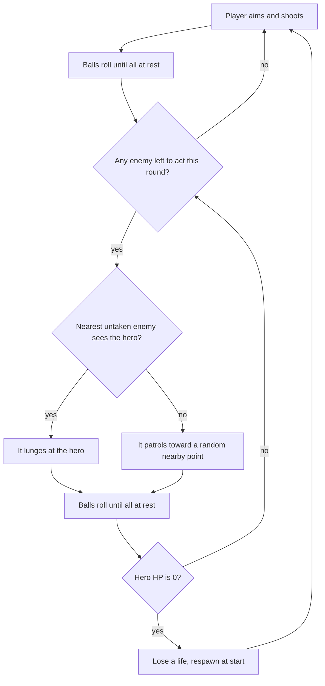

# Dungeonball — MVP Design Doc

Sep 18, 2026 · @Kirk

## Overview

Dungeonball is a portrait phone game where you are a pool ball fighting through dungeon rooms to the exit.

You pull back, release, and the ball ricochets off walls, barrels and enemies. Enemies that can see you lunge back, so where you stop matters as much as what you hit.

Design pillars:

- **Billiards feel first.** High-bounce ricochets, knockbacks and combos carry the fun, and stats stay simple.
- **Every stop is a decision.** Ending a shot in an enemy's sightline costs HP.
- **Risk against greed.** Gold is the score. Barrels and chests pay, but lingering near enemies is dangerous.
- **No surprises.** Aim preview, "!" alerts and visible HP bars make every loss legible.

Target: a true orthographic 3D view at a fixed isometric angle, rendered with Three.js and tested in a desktop browser first. The simulation underneath stays a 2D grid; only the rendering is 3D.

## Core loop and turn structure

A round is one shot by you, then a lunge from each enemy that can see you, one at a time, with everything settling between moves.



The loop repeats until the hero touches the exit, which ends the level at once, even mid-roll.

- **Order:** enemies act nearest-to-hero first, whether they end up attacking or patrolling. Sight is rechecked before each enemy's turn, since earlier moves this round can create or break sightlines.
- **Once per round:** each enemy acts exactly once per round, either lunging at the hero or patrolling, then the turn passes to the next enemy.
- **At rest:** the next launch, lunge or patrol move waits until every ball is below the stop threshold, so positions are always stable before the next move. Nothing moves outside a shot or a turn.
- **Patrol:** an enemy that does not currently see the hero picks a random open floor tile within about 3 tiles and rolls toward it at a random, modest speed. It behaves like any pool ball on the way, so it can still bounce off walls, barrels and other enemies. If no open tile is available, it stays put for that turn.
- **Exit:** enemies never follow you out. Killing everything is not required.
- **Enemy lunge:** an enemy that currently sees the hero launches in a straight line at it at a fixed speed instead of patrolling. Like any pool ball, it stays wherever it stops, which becomes its new position.

## Ball physics and input

Physics is a small custom circle solver on a fixed timestep, because the pool feel is the whole game. Matter.js is the fallback if the solver proves too much work.

Every value below is a starting point to tune by feel. Distances are in tiles.

| Parameter | Start value | Why |
| --- | --- | --- |
| Ball diameter | 0.65 tile | Leaves room to thread one-tile gaps |
| Cancel radius | 0.6 tile | Releasing closer than this cancels; wide enough to read as its own space |
| Full-power drag | 1.6 tiles | Drag distance that reaches max launch speed |
| Max launch speed | 9 tiles/s | Reached at full drag |
| Friction | 3.5 tiles/s² constant | About 2.6 s to stop from full power |
| Stop threshold | 0.25 tiles/s | Below this a ball counts as at rest |
| Wall bounce | keeps 90% of speed | High bounce, as requested |
| Barrel and chest bounce | keeps 70% of speed | Loses some speed on impact |
| Ball-to-ball collision | equal mass, keeps 90% | Pool-style momentum transfer |
| Enemy lunge speed | 6 tiles/s | Fixed for every enemy in the MVP |
| Physics step | 1/120 s, fixed | Fastest ball moves 0.075 tile per step, so nothing tunnels |

Aim is a slingshot pull-back: press on the hero, drag away from the target, release to launch the opposite way. Mouse and touch share one pointer path, raycast onto the ground plane so a drag means the same thing from any camera angle, and the pull-back keeps the finger off the line of fire. There's no cue stick sprite and no filling power ring; the dashed path preview below carries the aiming information, with a faint cancel marker under the hero.

- **Power:** drag distance past the cancel radius sets launch speed, reaching full power at about 1.6 tiles; it doesn't depend on the drag's angle.
- **Cancel marker:** while you drag, a thin, low-opacity circle at the cancel radius and a small "x" on the ground under the hero mark the cancel zone. Both brighten while your finger is inside it, and disappear when you release.
- **Cancel zone:** within about 0.6 tile of the hero the preview disappears, which reads as "release here to cancel." Releasing inside it cancels the shot; releasing past it fires.
- **Preview:** a dashed line on the ground that runs the shot through the real physics ahead of time, so its length is exactly how far the ball will travel at the current power, including friction and bounce losses. It shows the first bounce, marked with a small ring, then ends where the ball stops or at its next contact. The dash pattern also encodes power: a soft shot draws short, sparse dots, and a hard one draws long dashes packed close together.
- **Locked:** while any ball is moving or during the enemy phase.

## Combat rules and formulas

Who takes damage depends on whose phase it is, never on ball speed. Speed only decides how far things travel.

| Contact | Your shot | Enemy phase |
| --- | --- | --- |
| Hero hits enemy | Enemy loses ATK HP on each fresh contact | No damage |
| Knocked enemy hits enemy | Both lose 1 HP, once per pair per shot | No damage |
| Enemy hits hero | No damage to hero | Hero loses HP, only from the enemy whose turn it is (lunging or patrolling) |
| Anything hits a wall | No damage | No damage |
| Hero hits barrel or chest | Counts | Counts (recoil hits too) |
| Hero or enemy hits red barrel | That ball takes 1 flat damage | That ball takes 1 flat damage |

Damage and health formulas, with L as the enemy's level:

```latex
D_{\text{enemy}} = \text{ATK} \qquad D_{\text{hero}} = \max(1,\; L - \text{DEF}) \qquad \text{HP}_{\text{enemy}} = 2L
```

| Stat | Start value | Notes |
| --- | --- | --- |
| Hero max HP | 10 | Potions heal 3, capped at max |
| Hero ATK | 1 | A sword raises it to 2 |
| Hero DEF | 0 | A shield raises it to 1 |
| Enemy level L | 1 to 3 in the MVP | Shown on the enemy |
| Kill reward | 10 × L gold | Drops as coins where it died |

Combo example: with ATK 1, you hit enemy A and it slides into enemy B. A takes 2 damage in total and B takes 1. A level-1 enemy has 2 HP, so A dies and B is left at 1 HP if it is also level 1.

Pinning works too. Trap an enemy between you and a wall and your rebound can hit it again within the same shot. A hit counts only at an impact speed of at least 1.5 tiles/s, with a 0.15 s cooldown per enemy, so a ball resting against another cannot grind it down.

Every enemy that currently sees the hero shows a "!" above it, updated live even mid-shot, so you can steer toward a safe stopping spot. Sight range is 6 tiles. Walls, barrels, closed doors and other enemies block sight, and sight is a hero-width sweep so a lunge can really reach you. Watchers off screen get an edge marker. A patrolling enemy shows no marker and a calm expression; a sighted one shows the "!" now, and swapping to an alert expression (as in your sketch) is a good post-MVP addition.

## Lives, death and progression

You have 3 lives. Reaching 0 HP costs one life and puts you back at the level start with full HP, while the board stays exactly as you left it.

- **Board state persists:** dead enemies stay dead, damaged enemies stay damaged, broken barrels stay broken, opened chests and doors stay open, and keys you hold stay with you.
- **Respawn is safe:** enemies only act after your shot, so you always get the first move after respawning.
- **Extra lives** come only from a rare barrel drop.
- **Game over** at 0 lives restarts the current level from scratch with 3 lives, and the HP and gear you entered it with.
- **Between levels:** HP, gear bonuses, lives and score carry over. Unused keys do not.

Gold is the score, and it is where the risk against greed tension lives. Kills score and reduce future danger. Barrels and chests score too, but they keep you out in the open among enemies that are still alive.

Shots taken are tracked and shown on the level-complete screen but do not affect the score in the MVP.

## Objects

Barrels, chests, keys and doors are the level's furniture, and barrel and chest rewards are granted immediately with a short floating label above the hero.

| Object | Behavior |
| --- | --- |
| Barrel | Solid bumper. Each contact above 1.5 tiles/s cracks it one stage, with a 0.15 s cooldown per barrel. The third hit breaks it and rolls loot. |
| Chest | Solid bumper. The first contact opens it and grants 50 gold. |
| Key | Floor pickup, collected by rolling over it. Color-matched to one door and shown in a HUD slot. |
| Door | Solid and opaque until the hero is within half a tile while holding the matching key. Then it opens for good and the key is consumed. Enemies can pass through an open door. |
| Exit | Ends the level when the hero's center enters its tile. |
| Coins | Dropped where an enemy dies, worth 10 × its level in total. Collected by rolling over them, so grabbing them can pull you back into an enemy's sight. |
| Explosive barrel (red) | Solid bumper with the same physics as a barrel. Any contact from the hero or an enemy, at any speed, detonates it: the ball that touched it takes 1 flat damage, ignoring ATK and DEF, and the barrel is destroyed with no loot. |

Barrel loot uses these starting weights:

| Result | Chance | Effect |
| --- | --- | --- |
| Nothing | 30% | Empty |
| Gold | 35% | +10 to +30 gold |
| Health potion | 20% | +3 HP, capped at max |
| Sword | 6% | Equips a sword: ATK 2 |
| Shield | 6% | Equips a shield: DEF 1 |
| Extra life | 3% | +1 life |

There is no inventory. Each pickup floats above the hero for about a second, for example "+3 HP", "+20" or "Sword +1". Only the hero cracks barrels and opens chests.

A red barrel is a hazard, not a reward: it can hurt an enemy that bumps it as easily as it can hurt you, so it's worth luring enemies into one.

You hold at most one sword and one shield. A new one replaces the one in hand, so a duplicate changes nothing until gear tiers exist.

## Levels

Each level is a plain text file with one character per tile. The screen shows about 9 tiles across, and levels can be any size; the camera follows the hero, so larger ones scroll.

| Character | Meaning |
| --- | --- |
| `#` | Wall |
| `.` | Floor |
| `S` | Hero start |
| `X` | Exit |
| `O` | Barrel |
| `C` | Chest |
| `1` to `5` | Enemy of that level |
| `r` `b` `y` | Key: red, blue, yellow |
| `R` `B` `Y` | Door matching that key |
| `E` | Explosive barrel (red) |

An illustrative level in this format, with one enemy, two barrels, a chest, a red key and a red door in front of the exit:

```text
#########
#...X...#
#.......#
###R#####
#.......#
#.O.1.O.#
#.......#
#.C.r...#
#.......#
#...S...#
#########
```

Barrel loot is random by default. Per-barrel overrides can be added later without changing the format.

The five MVP levels ramp one idea at a time. Sizes are suggestions in tiles.

Until the other levels exist (M6–M7), Long Hall is the only level and reaching its exit sends the hero straight back to its start.

| # | Name | Size | Enemies | Keys and doors | Teaches |
| --- | --- | --- | --- | --- | --- |
| 1 | Long Hall | 12×32 | One level-1 | None | Aiming, bouncing, hitting an enemy, the exit |
| 2 | Breakables | 9×20 | Two level-1 | None | Barrels, chest, potions, sightlines |
| 3 | One Key | 12×20 | Level 1 and level 2 | Red | Keys, doors, hiding from sight |
| 4 | Two Keys | 14×24 | Four, levels 1 to 3 | Red, blue | Routing, combos, using enemies as blockers |
| 5 | Gauntlet | 16×32 | Seven, levels 1 to 3 | Red, blue, yellow | Scrolling, risk against greed, everything together |

## Camera, HUD and presentation

The camera is a true orthographic projection at a fixed isometric angle matched to your mockup: the grid is turned about 30° on screen (columns run gently down-right, rows run steeply down-left) and seen from about 37° above the ground, so parallel lines never converge and scale stays constant with distance. It never rotates and has no manual zoom; its only zoom is the automatic speed-based zoom below. It follows the hero, keeping it centred on screen with a gentle ease.

- **Camera type:** `THREE.OrthographicCamera`, fixed isometric angle, no rotation or manual zoom in the MVP. Angles live in the config as `camera.yawDeg` (30) and `camera.elevationDeg` (37).
- **Follow:** the camera eases to keep the hero at the centre of the screen, and its centre never leaves the level. (An earlier draft used a deadzone of 60% × 50% of the view; `camera.deadzoneWidth`/`deadzoneHeight` still support one.)
- **Enemy phase:** if an attacker is off screen, the camera pans to it briefly, then returns to the hero.
- **View size:** the orthographic frustum has a base width of 9 tiles measured across the screen (with the grid turned, that is not the same as 9 columns), adjusted for aspect ratio, and scales to fit the browser window.
- **Dynamic zoom:** the frustum widens as the hero speeds up, so a hard shot pulls the camera out to reveal more of its path, then eases back to the base 9-tile width once every ball is at rest. Default range: 9 tiles at rest up to about 13 tiles at max launch speed (9 tiles/s).
- **Walls:** short, so they never hide a ball behind them. The mockup's walls stand a little taller than the ball; the build uses 0.55 tile (`render.wallHeight`) so a ball resting just behind a wall stays visible.
- **Lighting:** one ambient light plus one directional light, no dynamic shadows for the MVP.
- **HUD:** a dark top bar as in your mock, with gold on the left, lives in the middle and key slots on the right. HP bars sit above the hero and each enemy, rendered as an HTML/CSS overlay on top of the canvas so they always face the viewer. The aim preview is different: it's drawn in the 3D scene itself, on the ground plane, so they land exactly where you're dragging under the isometric projection rather than as a flat screen overlay.
- **Art:** procedural 3D primitives matching your mockup: extruded boxes for walls, cylinders for barrels, boxes for chests, spheres for hero and enemies. Walls and floor are flat greys with no outlines, shaded per face (light tops, darker sides); balls and props are toon-shaded with outlines.

## Audio

Sound is MVP scope, not a later pass — a game about impacts needs impacts to sound like something.

**Ambient:** one looping ambient or music track plays under a level, non-positional. Per-level variation is a good post-MVP addition, not required now.

**Impact and event SFX:** a short one-shot per event — shot launch, wall bounce, barrel crack (rising in intensity across the three hits) and break, red barrel explosion, chest open, the hero's hit on an enemy, an enemy-to-enemy combo hit, enemy lunge launch, the hero taking damage, coin pickup, potion or sword or shield or extra-life pickup, key pickup, door unlock, level exit, and death or respawn.

**Implementation:** Three.js's built-in `THREE.AudioListener` and `THREE.Audio` cover both layers without adding a library. Non-positional playback is enough given the MVP's small view; simple stereo panning by world x-position is a nice-to-have, not required. For the MVP, source SFX and the ambient loop from a free, CC0 pack (for example, Kenney's audio assets) rather than composing original audio. Swapping in custom or licensed audio later doesn't change any of the event hookups.

Feedback to add once the loop is fun: a short hit-stop on damaging hits, floating damage numbers, a small screen shake, crack decals on barrels, ball squash on impact, and simple synthesized sounds.

## Tech and build order

Build it in Three.js (current stable release) with Vite and plain JavaScript, adding one system per step so every step is playable on its own.

Two habits keep tuning cheap. Put every number from this doc in one config file. Add a debug overlay that toggles sight rays, collision shapes and the current phase. To test on a phone, run the Vite dev server with `--host` and open the LAN address.

| Step | Adds | Playable result |
| --- | --- | --- |
| M0 | Vite and Three.js skeleton, orthographic camera at the isometric angle, text-level loader that draws walls as extruded boxes | Level 1 renders |
| M1 | Hero ball, slingshot aim, custom 2D physics, aim preview projected onto the ground plane, launch and bounce SFX | Bounce around an empty room |
| M2 | Deadzone camera and larger levels | Explore a tall level |
| M3 | Enemy balls, HP bars, your-shot damage and combos, hit SFX | Kill enemies with ricochets |
| M4 | Turn manager, line of sight, "!" markers, lunges, lives, respawn, lunge and hero-hit SFX | The full core loop |
| M5 | Barrels, chests, loot table, coin drops, floating labels, HUD, pickup and break SFX | Loot and score |
| M6 | Keys, doors, exit, carry-over between levels, door and key SFX | Finish a run of levels |
| M7 | Five levels, tuning pass, feedback effects, ambient music, phone test | The MVP |

## Out of scope for the MVP

These are good ideas that wait until the five-level loop is fun.

- Multiple weapon and shield tiers, or any gear comparison
- XP, leveling and permanent upgrades between runs
- Enemies that move on their own, shoot from range, or drop keys
- Bosses and special rooms
- Shot limits, par scores and star ratings
- Spin, curved shots or steering mid-roll
- Saved progress, a level editor and a level-select screen
- Real art: modeled assets and textures, as opposed to the procedural primitives
- Native packaging for phones, for example with Capacitor

## Assumptions and open questions

The rules above use these defaults where your answers left a gap. Change any that miss the intent.

- Knocked enemies that collide on your shot cost each other a flat 1 HP, not your ATK.
- Your hits on an enemy have no per-shot limit, so pinning one against a wall lands several hits. A pair of enemies trades damage at most once per shot, which stops grinding in tight rooms.
- Each enemy attacks at most once per round, and only the attacker (the enemy whose turn it is) can damage the hero. Red barrels are the exception: they damage whichever ball touches them, hero included, in any phase.
- If the hero dies mid-round, the round ends there: the remaining enemies skip their turn and the hero respawns with the first move.
- Sight range is 6 tiles, not the screen width, because a portrait screen is only 9 tiles wide. Other enemies also block sight, so they can shield you.
- Gear is one sword (ATK 2) and one shield (DEF 1), so the maximum is the one in hand and a duplicate pickup changes nothing.
- Barrel loot and chest gold are granted at once with a floating label. Keys and enemy coins lie on the floor.
- Respawn restores full HP, and keys you hold are kept.
- Aiming is a slingshot pull-back rather than dragging toward the target.
- An explosive barrel deals a flat 1 damage regardless of stats, ignores the normal 1.5 tiles/s hit threshold, and drops no loot.
- Zoom tracks the hero's speed only. Enemy lunges and patrols don't drive it.
- Patrol speed is 1–3 tiles/s, well under the 6 tiles/s lunge speed, so a patrolling enemy always reads as calmer than an attacking one.
- A patrol move follows normal physics, so if it happens to collide with the hero it still deals damage, the same as a lunge would. Contact is what matters, not intent.
- The "nearest first" turn order from the original attack-only design now covers every enemy, sighted or not, so a patrolling enemy can still block or reveal sightlines for the ones after it.

No open questions remain for the MVP; new ones will get added here as they come up.
